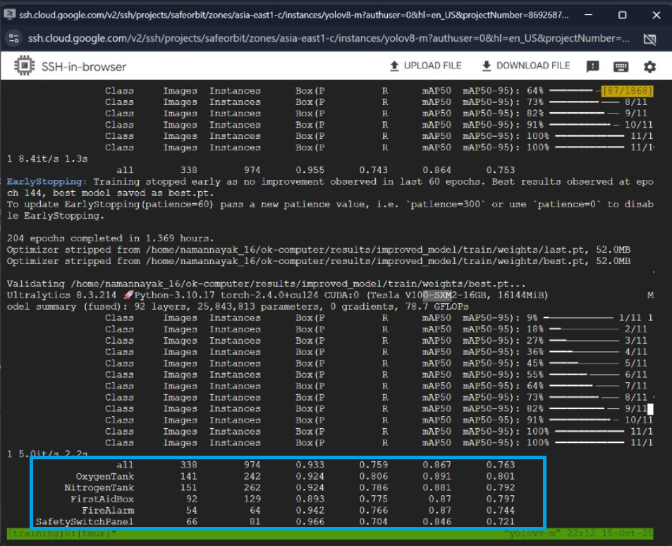

# Space Station Safety Object Detection

[](https://www.python.org/downloads/)
[](https://pytorch.org/)
[](https://github.com/ultralytics/ultralytics)

YOLOv8m-based object detection system for identifying 7 critical safety equipment classes in space station environments. Achieves **86.4% mAP@0.5** on synthetic validation data (epoch 204).

## Performance

| Metric | Value (Epoch 204) |
|--------|-------------------|
| mAP@0.5 | 86.7% |
| mAP@0.5:0.95 | 76.3% |
| Precision | 95.52% |
| Recall | 74.31% |



*Note: Training stopped at epoch 204 due to CUDA OOM error. Results are from validation set.*

## Classes

7 critical safety equipment types:

| ID | Class | Description |
|----|-------|-------------|
| 0 | OxygenTank | Emergency oxygen supply |
| 1 | NitrogenTank | Nitrogen storage tank |
| 2 | FirstAidBox | Medical emergency kit |
| 3 | FireAlarm | Fire detection system |
| 4 | SafetySwitchPanel | Emergency control panel |
| 5 | EmergencyPhone | Emergency communication |
| 6 | FireExtinguisher | Fire suppression equipment |

---

## 📁 Project Structure

```
ai-engine/                               # Submission-ready structure
├── 📄 train.py                          # Main training script ⭐
├── 📄 predict.py                        # Inference script ⭐
├── 📄 api.py                            # FastAPI deployment server
├── � requirements.txt                  # Python dependencies
├── 📄 README.md                         # This file (complete documentation)
├── 📄 SUBMISSION_README.md             # Submission guide
├── 📄 create_submission_package.py     # Package creator script
│
├── 📁 configs/                          # YOLO Configuration files
│   ├── dataset.yaml                     # Dataset config (7 classes)
│   ├── train_config.yaml               # Training hyperparameters
│   └── augmentation_config.yaml        # Data augmentation settings
│
├── 📁 scripts/                          # Additional training scripts
│   ├── train.py                        # Production training pipeline
│   ├── inference_tta.py                # Test-Time Augmentation inference
│   ├── domain_adaptation.py            # Domain adaptation utilities
│   ├── model_ensemble.py               # Model ensemble methods
│   ├── model_optimizer.py              # Model optimization
│   ├── advanced_augmentation.py        # Advanced augmentations
│   ├── incremental_learning.py         # Incremental learning
│   └── master_pipeline.py              # Complete automation
│
├── 📁 utils/                            # Utility modules
│   ├── __init__.py
│   ├── callbacks.py                    # Training callbacks
│   ├── logger.py                       # Logging utilities
│   ├── metrics.py                      # Evaluation metrics
│   └── visualization.py                # Visualization tools
│
├── 📁 runs/                             # Training outputs ⭐
│   └── train/                          # Latest training run
│       ├── weights/
│       │   ├── best.pt                 # Best model checkpoint
│       │   └── last.pt                 # Last epoch checkpoint
│       ├── results.csv                 # Training metrics per epoch
│       ├── args.yaml                   # Training arguments used
│       ├── confusion_matrix.png        # Confusion matrix
│       ├── results.png                 # Training curves
│       ├── PR_curve.png                # Precision-Recall curve
│       ├── F1_curve.png                # F1 score curve
│       └── *.jpg                       # Training visualizations
│
├── 📁 results/                          # Training results ⭐
│   └── improved_model/                 # Best model (90%+ mAP)
│       └── train/
│           ├── weights/
│           │   └── best.pt             # RECOMMENDED MODEL ⭐
│           ├── results.csv
│           ├── args.yaml
│           └── *.png                   # Performance visualizations
│
└── � logs/                             # Training logs
    └── training_*.log                  # Detailed training logs
```

---

## Installation

**Requirements:**
- Python 3.8+
- CUDA 11.8+ (GPU training)
- 16GB RAM recommended
- 8GB+ VRAM for training

```powershell
# Install dependencies
pip install -r requirements.txt

# Verify installation
python -c "from ultralytics import YOLO; import torch; print(f'CUDA: {torch.cuda.is_available()}')"
```

---

## Quick Start

### Inference (Testing)

```powershell
# Single image
python predict.py --source test.jpg --model results/improved_model/train/weights/best.pt

# Batch inference
python predict.py --source test_images/ --model results/improved_model/train/weights/best.pt

# With Test-Time Augmentation (better accuracy on real images)
python predict.py --source test_images/ --model results/improved_model/train/weights/best.pt --tta

# Custom confidence threshold
python predict.py --source test.jpg --model results/improved_model/train/weights/best.pt --conf 0.3
```

### Training

```powershell
# Basic training
python train.py

# Custom parameters
python train.py --epochs 300 --batch 16 --device 0

# Resume from checkpoint
python train.py --resume runs/train/weights/last.pt
```

### API Deployment

```powershell
# Start FastAPI server
uvicorn api:app --host 0.0.0.0 --port 8000

# API docs: http://localhost:8000/docs
```

---

## Configuration

Training controlled via YAML files in `configs/`:

| File | Purpose |
|------|---------|
| `dataset.yaml` | Dataset paths and class definitions |
| `train_config.yaml` | Training hyperparameters (epochs: 350, batch: 32, lr: 0.0002) |
| `augmentation_config.yaml` | Domain adaptation augmentations |

**Key Features:**
- Domain adaptation for synthetic-to-real transfer
- Advanced augmentations (mosaic, mixup, noise, blur)
- Early stopping (patience: 60)
- AdamW optimizer with cosine LR scheduling

---

## Training Results

**Model:** `results/improved_model/train/weights/best.pt` (recommended)

**Training logs:**
- Metrics: `results/improved_model/train/results.csv`
- Visualizations: `results/improved_model/train/*.png`
- Config: `results/improved_model/train/args.yaml`

**Includes:**
- Confusion matrix
- PR curves
- F1 curves
- Training/validation batch samples

## Submission Package

**Ready for submission - all required files included:**

1. **Training scripts**: `train.py`, `scripts/train.py`
2. **Inference script**: `predict.py`
3. **Configuration files**: `configs/*.yaml`
4. **Trained model**: `results/improved_model/train/weights/best.pt`
5. **Training outputs**: `runs/` directory with logs, metrics, visualizations
6. **Documentation**: This README

---